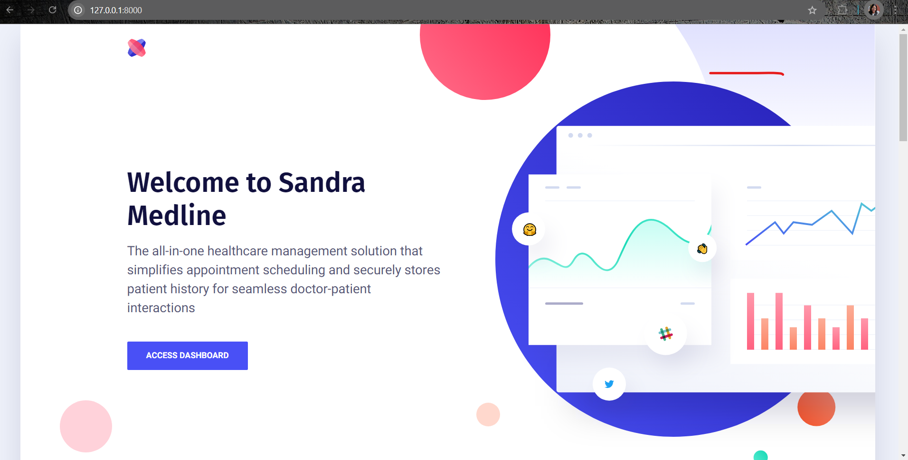
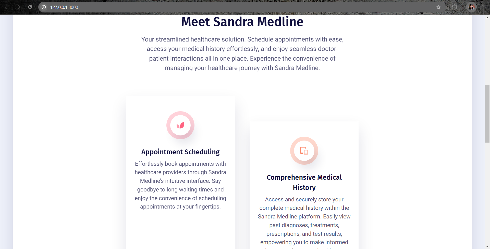
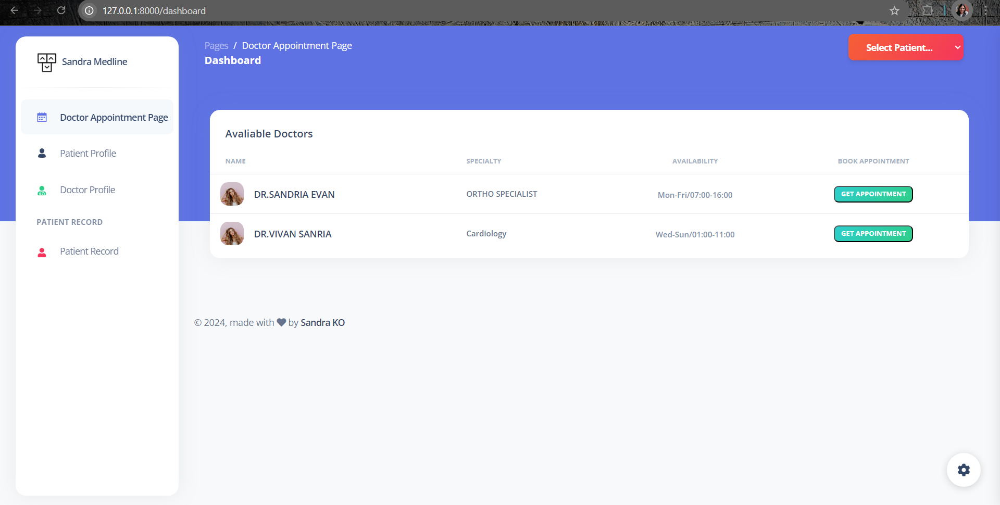
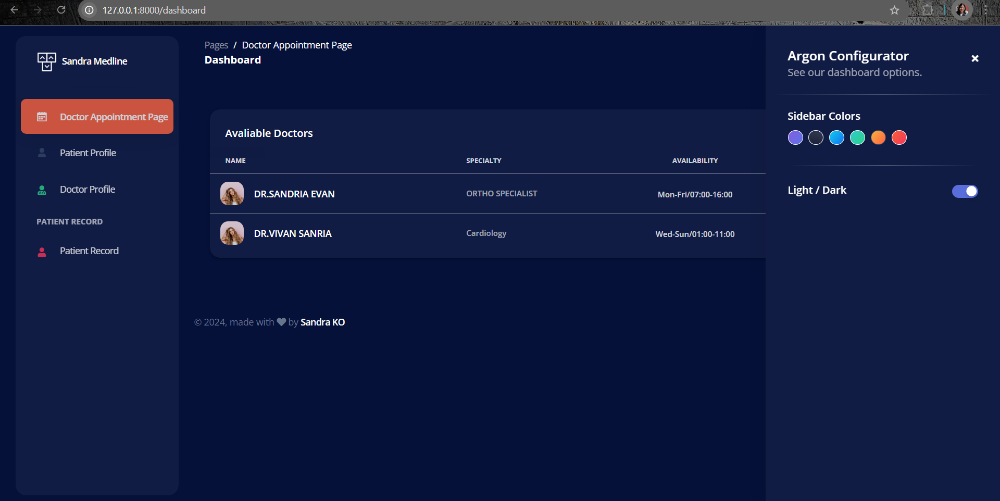
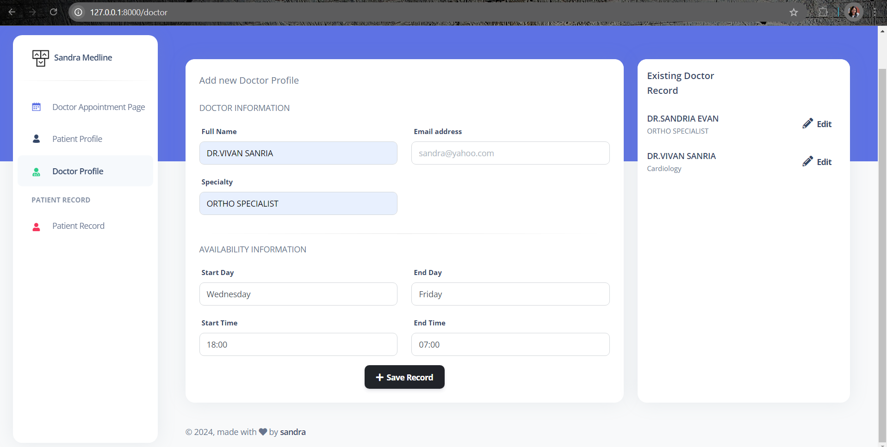
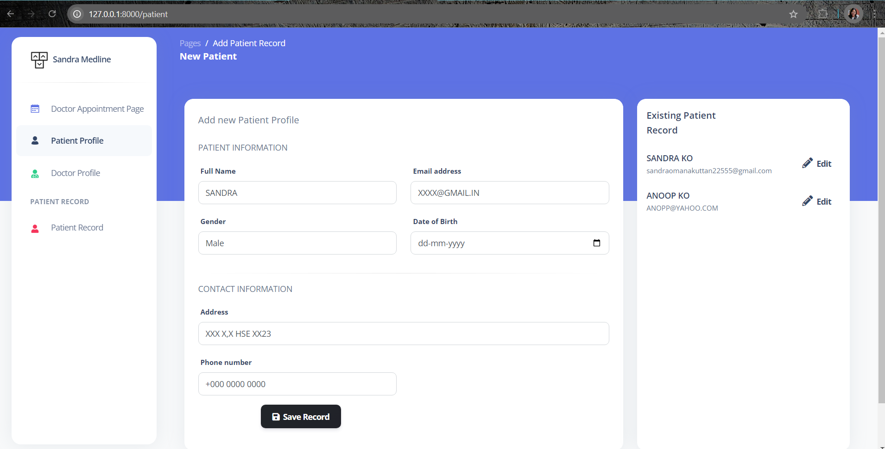

# Welcome to Sandra Medline

Sandra Medline is your all-in-one healthcare management solution that simplifies appointment scheduling and securely stores patient history for seamless doctor-patient interactions.

## Access Dashboard

## Meet Sandra Medline

Your streamlined healthcare solution. Schedule appointments with ease, access your medical history effortlessly, and enjoy seamless doctor-patient interactions all in one place. Experience the convenience of managing your healthcare journey with Sandra Medline.

## Features

### Appointment Scheduling

Effortlessly book appointments with healthcare providers through Sandra Medline's intuitive interface. Say goodbye to long waiting times and enjoy the convenience of scheduling appointments at your fingertips.

### Comprehensive Medical History

Access and securely store your complete medical history within the Sandra Medline platform. Easily view past diagnoses, treatments, prescriptions, and test results, empowering you to make informed decisions about your healthcare.

### Seamless Doctor-Patient Communication

Stay connected with your healthcare providers through Sandra Medline's efficient communication system. Receive important updates, reminders, and follow-up instructions directly from your doctor, ensuring effective care coordination and personalized attention.

### Secure and Confidential

Sandra Medline prioritizes the privacy and security of your health information. Rest assured that your data is protected with industry-standard encryption protocols and strict access controls, ensuring your sensitive medical records remain confidential.

## Technologies Used

## Stay in the Know

- **Contact**: [Contact Us](mailto:support@sandramedline.com)
- **About Us**: Learn more about our mission and values.
- **FAQs**: Frequently asked questions to assist you.
- **Support**: Get help and support from our dedicated team.
